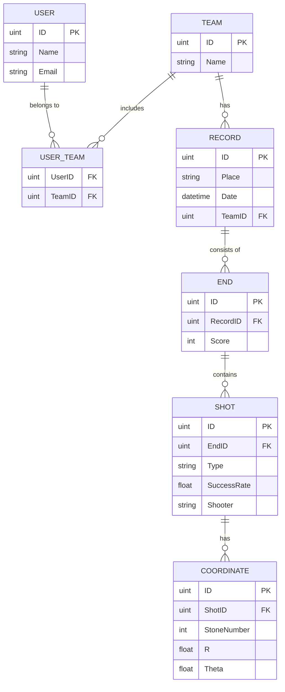

```mermaid
erDiagram
    USER {
        uint ID PK
        string Name
        string Email
    }

    TEAM {
        uint ID PK
        string Name
    }

    RECORD {
        uint ID PK
        string Place
        datetime Date
        uint TeamID FK
    }

    END {
        uint ID PK
        uint RecordID FK
        int Score
    }

    SHOT {
        uint ID PK
        uint EndID FK
        string Type
        float SuccessRate
        string Shooter
    }

    COORDINATE {
        uint ID PK
        uint ShotID FK
        int StoneNumber
        float R
        float Theta
    }

    USER_TEAM {
        uint UserID FK
        uint TeamID FK
    }

    USER ||--o{ USER_TEAM: "belongs to"
    TEAM ||--o{ USER_TEAM: "includes"
    TEAM ||--o{ RECORD: "has"
    RECORD ||--o{ END: "consists of"
    END ||--o{ SHOT: "contains"
    SHOT ||--o{ COORDINATE: "has"


```