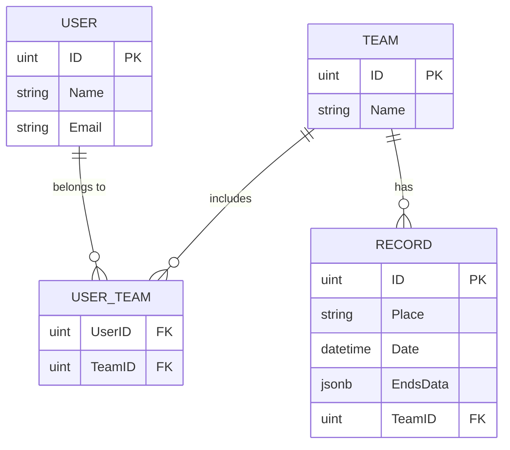

```mermaid
erDiagram
    USER {
        uint ID PK
        string Name
        string Email
    }

    TEAM {
        uint ID PK
        string Name
    }

    RECORD {
        uint ID PK
        string Place
        datetime Date
        jsonb EndsData
        uint TeamID FK
    }

    USER_TEAM {
        uint UserID FK
        uint TeamID FK
    }

    USER ||--o{ USER_TEAM: "belongs to"
    TEAM ||--o{ USER_TEAM: "includes"
    TEAM ||--o{ RECORD: "has"


```